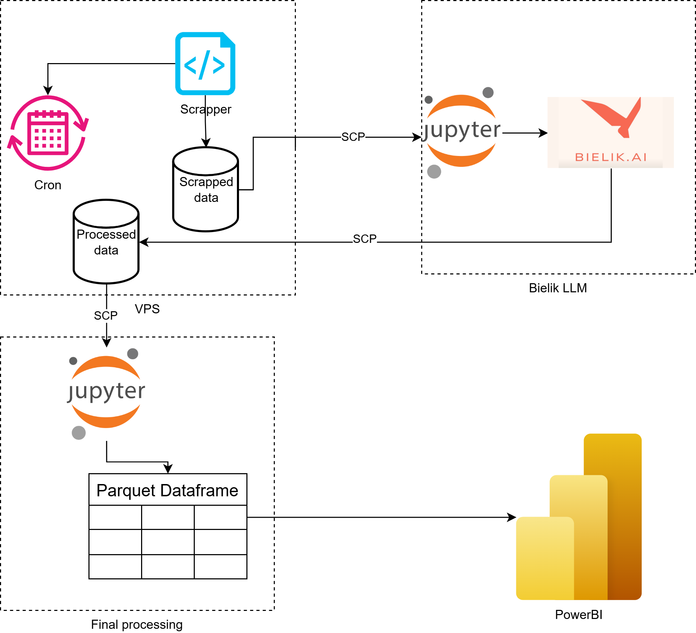

# Estate Data Transformation & EDA

Jupyter Notebooks designed to process, transform, and analyze real estate listings of building plots in the vicinity of Łomża.

<div align="center">
  
</div>

## Workflow

* **Fetch:** Connects to a remote VPS database via SSH/SCP to download scraped and LLM-processed listings (`olx.db`).
* **Process:** Uses `Polars` and `Pandas` to clean data, standardize locations, calculate geographic distances (Haversine), and perform Exploratory Data Analysis (EDA) including price predictions using Random Forest.
* **Export:** Saves the final processed data and time-series statistics as `.parquet` files for Power BI reporting.

## Setup

### Hardware Requirements

* **CPU:** Standard modern processor (GPU is not required for this final processing stage).
* **RAM:** At least 8GB recommended for in-memory data processing and EDA.

### Installation

This project uses `uv` for reproducible dependency management. 
Clone the repository and sync the environment:
```bash
uv sync 
